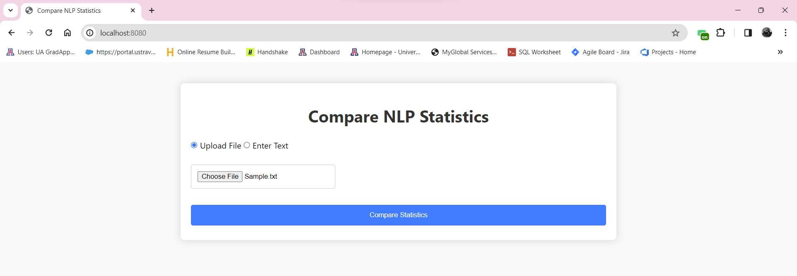
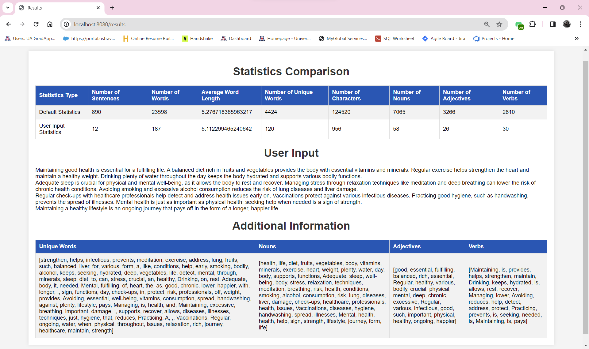
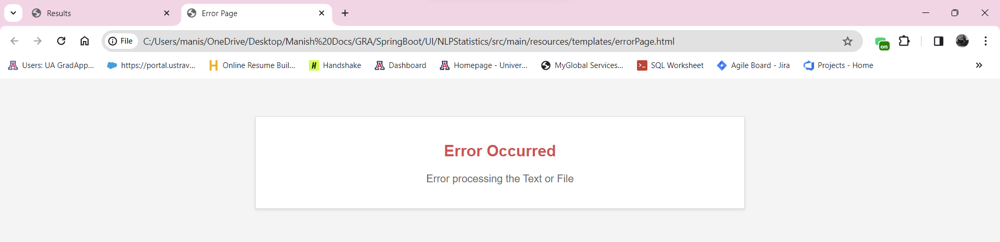

HealthStatsNLP

Project Overview
HealthStatsNLP is a web-based application designed for scraping, analyzing, and comparing health-related content using Natural Language Processing (NLP) techniques. It consists of a Python script for data scraping and a Java-based web application for user interaction and data presentation.

Features
Python Web Scraper (api.py): Scrapes health-related web pages and computes NLP statistics.
Java Spring Web Application:
Main Application (NlpStatisticsApplication.java): Sets up the Spring Boot application.
Web Controller (WebPageController.java): Manages web requests and NLP data processing.

Web Pages: Includes index.html (main page) 

results.html (displays results) 

errorPage.html

Getting Started
These instructions will guide you on setting up the project locally.

Prerequisites
Python 3.x
Java JDK 8 or higher
Maven (for dependency management)

Installation
Clone the repository: git clone [https://github.com/thondepumanish/HealthStatsNLP.git]

Usage
Run the Python script which is located in the API folder: python api.py
Start the Java Spring application whose project folder can be found in the UI folder (can be run through Eclipse IDE)
Access the web application via localhost:[8080]

